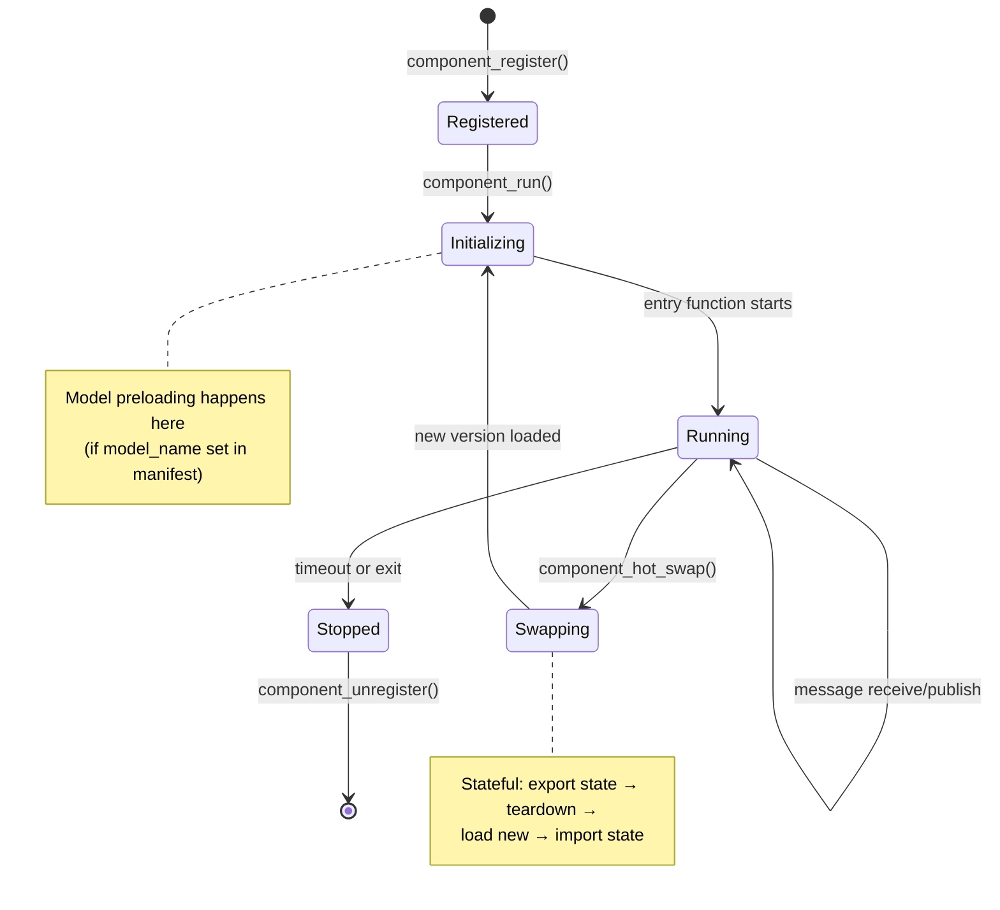
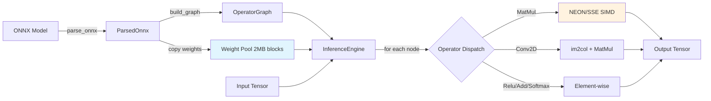
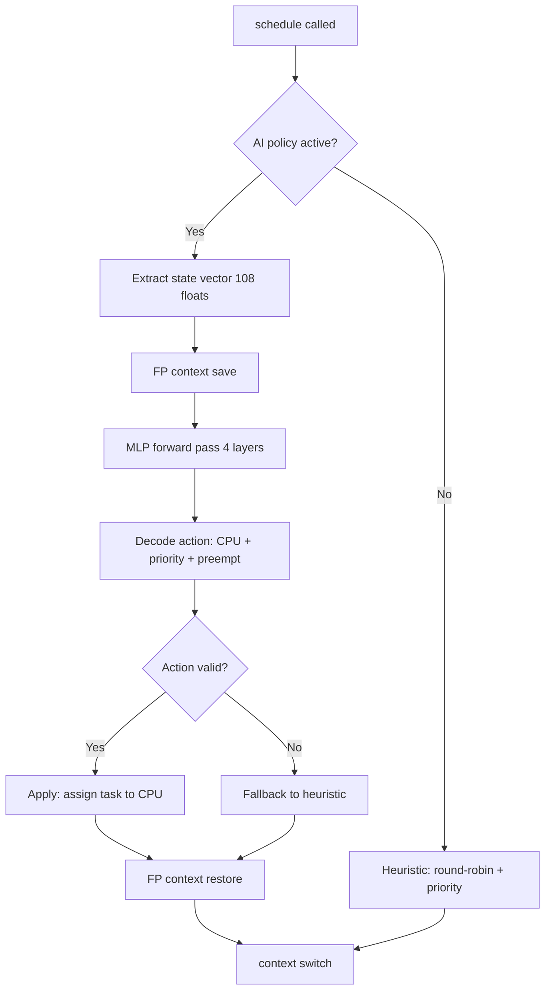

# SLM-OS Architecture

High-level architecture documentation for the Small Language Model Operating System.

**Status:** Phase 6 — Demo & Polish (April 2026)

---

## Overview

SLM-OS is a bare-metal operating system designed for running AI inference workloads on edge devices. The system is built as a hybrid C/Rust kernel with specialized support for AI model memory management and deadline-aware scheduling. Development targets multiple ARM64 platforms (QEMU virt, Raspberry Pi 5, NVIDIA Jetson Orin Nano) with an experimental x86-64 port.

```
┌─────────────────────────────────────────────────────────────────────────────┐
│                           SLM-OS Architecture                                │
├─────────────────────────────────────────────────────────────────────────────┤
│                                                                              │
│   ┌─────────────────────────────────────────────────────────────────────┐   │
│   │                    Application Layer (Phase 5)                       │   │
│   │     Components, ONNX Inference, Message Routing, EL0 Isolation      │   │
│   └─────────────────────────────────────────────────────────────────────┘   │
│                                    │                                         │
│                                    ▼                                         │
│   ┌─────────────────────────────────────────────────────────────────────┐   │
│   │                     Rust Runtime Layer                               │   │
│   │  ┌──────────┐ ┌──────────┐ ┌───────────┐ ┌──────────┐ ┌────────┐   │   │
│   │  │  Model   │ │Inference │ │   GPU     │ │Scheduler │ │  FFI   │   │   │
│   │  │  Loader  │ │  Engine  │ │  Backend  │ │  Policy  │ │  Log   │   │   │
│   │  └──────────┘ └──────────┘ └───────────┘ └──────────┘ └────────┘   │   │
│   └─────────────────────────────────────────────────────────────────────┘   │
│                                    │ FFI                                     │
│                                    ▼                                         │
│   ┌─────────────────────────────────────────────────────────────────────┐   │
│   │                      C Kernel Layer                                  │   │
│   │  ┌────────┐ ┌────────┐ ┌────────┐ ┌────────┐ ┌────────┐ ┌────────┐  │   │
│   │  │  PMM   │ │  VMM   │ │ Sched  │ │  IPC   │ │  VFS   │ │  GPU   │  │   │
│   │  │        │ │  MMU   │ │        │ │        │ │   FS   │ │  HAL   │  │   │
│   │  └────────┘ └────────┘ └────────┘ └────────┘ └────────┘ └────────┘  │   │
│   └─────────────────────────────────────────────────────────────────────┘   │
│                                    │                                         │
│                                    ▼                                         │
│   ┌─────────────────────────────────────────────────────────────────────┐   │
│   │                     Hardware Abstraction                             │   │
│   │  ┌──────────┐ ┌──────────┐ ┌──────────┐ ┌──────────┐ ┌──────────┐   │   │
│   │  │UART PL011│ │ RP1 UART │ │ GIC-400  │ │ARM Timer │ │ Block Dev│   │   │
│   │  └──────────┘ └──────────┘ └──────────┘ └──────────┘ └──────────┘   │   │
│   └─────────────────────────────────────────────────────────────────────┘   │
│                                    │                                         │
│                                    ▼                                         │
│   ┌─────────────────────────────────────────────────────────────────────┐   │
│   │                    Hardware (ARM64 / Cortex-A78AE / Cortex-A76)      │   │
│   │       QEMU virt │ Raspberry Pi 5 │ Jetson Orin Nano │ x86-64 (exp.) │   │
│   └─────────────────────────────────────────────────────────────────────┘   │
│                                                                              │
└─────────────────────────────────────────────────────────────────────────────┘
```

---

## Design Principles

### 1. Hybrid C/Rust Architecture

- **C Kernel**: Core OS primitives (memory, scheduling, IPC, hardware drivers)
- **Rust Runtime**: Higher-level policies, model memory management, AI scheduling
- **FFI Boundary**: Clean separation with type-safe wrappers

This hybrid approach leverages:
- C for low-level hardware control and established OS patterns
- Rust for memory-safe higher-level logic and future AI integration

### 2. AI-First Memory Design

- **2MB aligned pools** for model weights (reduces TLB pressure)
- **Separate weight/workspace pools** (weights read-only and shareable)
- **Zero-copy sharing** via reference counting
- **GPU-ready allocation** (cache coherent, aligned for DMA)

### 3. Deadline-Aware Scheduling

- **Hybrid priority/deadline** algorithm
- **8 priority levels** with automatic deadline boost
- **Per-CPU run queues** for scalability
- **Priority inheritance** for mutex operations
- **Core isolation** for latency-sensitive workloads

### 4. Platform Abstraction

- **Device Tree parsing** for runtime hardware discovery (with fallback)
- **Compile-time platform selection** via CMake
- **Common driver interfaces** (UART, timer, interrupt controller)
- **QEMU virt** as primary development platform
- **Raspberry Pi 5** (BCM2712) as secondary hardware target — boots to interactive shell
- **Jetson Orin Nano** as original hardware target (blocked by CBB firewall)
- **x86-64** experimental port (multiboot2 boot, serial output)

---

## Subsystem Overview

### Platform Support

| Component | File(s) | Purpose |
|-----------|---------|---------|
| DTB Parser | `kernel/src/dtb.c` | Device Tree parsing for hardware discovery |
| Platform Info | `kernel/include/platform.h` | Compile-time fallback values |
| RP1 UART Driver | `kernel/drivers/uart_rp1_bitbang.c` | Pi 5 UART via RP1 southbridge |
| x86-64 Boot | `kernel/arch/x86_64/boot.S`, `entry64.S` | Multiboot2 boot, long mode entry |
| x86-64 Main | `kernel/arch/x86_64/main_x86.c` | x86-64 kernel entry point |

**Supported Platforms:**

| Platform | Status | Notes |
|----------|--------|-------|
| QEMU virt | Primary development | Full feature set, VirtIO-Net networking |
| Raspberry Pi 5 | Hardware target | 4-core SMP, boots to interactive shell, UART TX/RX working, preemptive scheduling at 100 Hz. See `docs/pi5-baremetal-status.md` |
| Jetson Orin Nano | Working | EL2+VHE boot, UARTC serial, GICv3, 6.7GB RAM, GPU probe. Single-core (SMP needs UEFI boot). See `docs/jetson-el2-bringup.md` |
| x86-64 | Experimental | Multiboot2 boot, serial output, basic subsystem init |

**Phase 3 Learnings:**
- DTB passed in x0 by bootloader (U-Boot, UEFI)
- QEMU ELF boot doesn't pass DTB (x0 is NULL)
- Fallback to compile-time defaults ensures reliable boot

### Memory Management

| Component | File(s) | Purpose |
|-----------|---------|---------|
| PMM | `kernel/mm/pmm.c` | Physical page allocation (buddy allocator) |
| VMM | `kernel/mm/vmm.c` | Virtual memory mapping |
| MMU | `kernel/arch/arm64/mmu.S` | Page table management (ARMv8) |
| Model Memory | `runtime/src/mm/` | 2MB-aligned model weight/workspace pools |

**Phase 4 Updates:**
- Buddy allocator replaces bitmap allocator for O(log n) allocation
- Orders 0-18 (4KB to 1GB blocks) with automatic splitting/coalescing
- Reduces fragmentation for large model allocations
- 2MB block alignment dramatically reduces TLB misses for large models
- Separate pools for weights vs workspace simplifies sharing semantics
- Generation counters in handles detect use-after-free

### Scheduling

| Component | File(s) | Purpose |
|-----------|---------|---------|
| Scheduler | `kernel/sched/sched.c` | Per-CPU run queues, priority ordering |
| Task Management | `kernel/sched/task.c` | Task lifecycle, context switch |
| Context Switch | `kernel/arch/arm64/context.S` | Register save/restore |
| PI Mutex | `kernel/ipc/pi_mutex.c` | Priority-inheriting mutex |
| Deadline Policy | `runtime/src/sched/deadline.rs` | Deadline analysis, core hints |
| Heterogeneous | `runtime/src/sched/heterogeneous.rs` | big.LITTLE topology awareness |

**Phase 3 Learnings:**
- Deadline boost thresholds (10ms/50ms/100ms) provide good responsiveness
- Priority inheritance prevents unbounded priority inversion
- Core isolation useful for latency-sensitive inference tasks

### Inter-Process Communication

| Component | File(s) | Purpose |
|-----------|---------|---------|
| Message Queues | `kernel/ipc/ipc.c` | Synchronous message passing |
| Shared Memory | `kernel/ipc/ipc.c` | Zero-copy buffer sharing |

**Phase 3 Learnings:**
- Timeout support essential for robust applications
- Statistics tracking helps debug queue sizing issues
- Single-threaded stress tests more reliable than multi-task in early development

### SMP Support

| Component | File(s) | Purpose |
|-----------|---------|---------|
| SMP Boot | `kernel/sched/smp.c`, `smp_boot.S` | Secondary CPU initialization |
| Spinlocks | `kernel/include/spinlock.h` | Multi-core synchronization |
| IPI | `kernel/src/gic.c` | Inter-processor interrupts |

**Phase 3 Learnings:**
- PSCI is the standard way to boot secondary cores
- Per-CPU stacks must be allocated before secondary boot
- Spinlock ordering prevents deadlocks (always lock in CPU ID order)

### GPU Subsystem

| Component | File(s) | Purpose |
|-----------|---------|---------|
| GPU HAL | `kernel/gpu/gpu.c` | Driver registration, dispatch |
| Cache Ops | `kernel/gpu/cache.c` | ARM64 cache maintenance |
| Stub Driver | `kernel/gpu/gpu_stub.c` | QEMU (no GPU) fallback |

**Phase 3 Learnings:**
- Modern NVIDIA GPUs require GSP firmware (not bare-metal accessible)
- Focus on memory/cache coherency; defer compute to TensorRT (Phase 5)
- Platform abstraction allows development on QEMU while targeting Jetson

### Filesystem Subsystem

| Component | File(s) | Purpose |
|-----------|---------|---------|
| VFS | `kernel/src/vfs.c` | Unified namespace, mount points |
| Block Device | `kernel/drivers/blkdev.c` | Storage device abstraction |
| RAM Disk | `kernel/drivers/ramdisk.c` | Memory-backed block device |
| LittleFS Wrapper | `kernel/fs/littlefs_slm.c` | Flash filesystem integration |
| LittleFS VFS | `kernel/fs/littlefs_vfs.c` | VFS adapter for LittleFS |
| String Functions | `kernel/src/string.c` | Freestanding libc string ops |

**Phase 4 Implementation:**
- Block device abstraction for hardware-independent storage
- RAM disk driver for development/testing (no hardware dependencies)
- LittleFS for flash-friendly persistent storage
- VFS mount point support unifies virtual and persistent files
- Shell access via `ls` and `cat` commands

### Networking Subsystem

| Component | File(s) | Purpose |
|-----------|---------|---------|
| VirtIO-Net | `kernel/drivers/virtio_net.c` | Network driver (QEMU) |
| lwIP Wrapper | `kernel/net/lwip_slm.c` | TCP/IP stack integration |
| OS Abstraction | `kernel/net/sys_arch.c` | lwIP platform layer |
| Shell Commands | `kernel/src/net_shell.c` | ping, ifconfig, netstat |

**Phase 4 Implementation:**
- lwIP TCP/IP stack for ICMP, TCP, UDP, DHCP
- VirtIO-Net driver for QEMU virtual networking
- Shell commands: `net`, `ping`, `ifconfig`, `netstat`
- Static IP and DHCP configuration support

### Lua Scripting Engine

| Component | File(s) | Purpose |
|-----------|---------|---------|
| Lua Integration | `kernel/src/lua_slm.c` | Lua 5.4 state management and kernel bindings |
| Libc Stubs | `kernel/src/lua_stubs.c` | Freestanding libc shims for Lua runtime |
| Shell Commands | `kernel/src/lua_shell.c` | `lua` command: REPL, inline exec, script files |

**Phase 4 Implementation:**
- Lua 5.4 engine running in freestanding kernel environment
- Interactive REPL via `lua` shell command
- Inline execution via `lua -e "code"`
- Script file execution from VFS via `lua <filename>`
- SLM-OS kernel bindings exposed as the `slm` table (`slm.uptime`, `slm.tasks`, `slm.mem`, `slm.print`, etc.)
- Custom libc stub layer routes Lua's C library dependencies through kernel primitives

See `docs/lua.md` for full documentation.

### ELF Loader

| Component | File(s) | Purpose |
|-----------|---------|---------|
| ELF64 Loader | `kernel/src/elf.c` | Parse and load ARM64 ELF binaries |

**Phase 4 Implementation:**
- Minimal ELF64 parser for ARM64 executables
- Loads program segments into allocated memory
- Creates a new task with standard `main(argc, argv)` entry convention
- Accessible from the shell via the `run` command

### Component System

| Component | File(s) | Purpose |
|-----------|---------|---------|
| Component (C) | `kernel/src/component.c` | C helper functions and state names |
| Component (Rust) | `runtime/src/component/` | Core component lifecycle management |

**Phase 4 Implementation:**
- Lifecycle management for SLM workloads (loaded, initializing, running, suspended, updating, terminating, unloaded)
- Shell interface via `component` command (list, register, status)
- Designed as the runtime unit for model inference tasks

---

## Phase 5: SLM Integration

Phase 5 delivers the AI inference capabilities that justify the "SLM" in SLM-OS. The prior phases built the OS primitives (memory, scheduling, IPC, filesystem, components); Phase 5 connects them into a working inference pipeline.

```
┌─────────────────────────────────────────────────────────────────────────┐
│                        Phase 5 Inference Stack                          │
├─────────────────────────────────────────────────────────────────────────┤
│                                                                         │
│   Shell Commands ──> FFI ──> Rust Runtime                               │
│   (model load/infer/bench)    ├── Model Loader (ONNX Protobuf Parser)  │
│                               │    ├── Protobuf wire format decoder     │
│                               │    ├── ONNX schema interpreter          │
│                               │    └── Model Registry (up to 8 models)  │
│                               ├── Inference Engine                      │
│                               │    ├── Operator dispatch (9 ops)        │
│                               │    ├── Workspace bump allocator         │
│                               │    └── Tensor binding table             │
│                               ├── GPU Backend                           │
│                               │    ├── Capability detection             │
│                               │    ├── Operator placement heuristic     │
│                               │    └── CPU fallback (always available)  │
│                               └── Statistics                            │
│                                    ├── Inference counters (atomic)      │
│                                    └── Latency tracking (min/max/avg)   │
│                                                                         │
│   Components ──> Message Router ──> Inference FFI                       │
│   (sensor_monitor,                  (rust_model_find,                   │
│    digit_classifier)                 rust_infer_classify)               │
│                                                                         │
│   Syscall Interface (EL0/EL1)                                           │
│   ├── SVC dispatch (7 syscalls)                                         │
│   ├── Fault isolation (handle_user_fault)                               │
│   └── User pointer validation                                           │
│                                                                         │
└─────────────────────────────────────────────────────────────────────────┘
```

### ONNX Model Loader

The model loader pipeline consists of three stages:

1. **Protobuf parser** (`runtime/src/loader/protobuf.rs`): Decodes the ONNX protobuf wire format (varint, fixed32/64, length-delimited fields) using zero-copy iteration over borrowed byte slices. No heap allocation required.

2. **ONNX parser** (`runtime/src/loader/onnx_parser.rs`): Interprets ONNX-specific field numbers (hardcoded from `onnx.proto3`) to extract the computation graph, operator nodes, weight tensors, and I/O specifications. Produces a `ParsedOnnx` struct (~6 KB, stack-allocated).

3. **Model registry** (`runtime/src/loader/registry.rs`): Stores up to 8 loaded models with their operator graphs, weight tables, and memory handles. Thread-safe via spinlock. Supports load, unload, find-by-name, and enumeration.

Weight data is copied from the ONNX protobuf into the model memory weight pool (2 MB aligned blocks from the Phase 3 allocator). A separate workspace allocation provides scratch space for inference.

### CPU Inference Engine

The inference engine (`runtime/src/inference/engine.rs`) executes operator graphs on the CPU:

| Component | Purpose |
|-----------|---------|
| `InferenceEngine` | Static engine with spinlock serialization |
| `BumpAllocator` | Workspace memory manager (reset between calls) |
| Tensor binding table | Maps tensor names to data pointers (max 32 bindings) |
| Operator dispatch | Executes nodes in topological order |

**Supported operators for execution:**

| Operator | Implementation |
|----------|---------------|
| MatMul | Matrix multiplication (M x K x K x N) |
| Add | Element-wise addition with broadcasting |
| Relu | Element-wise max(0, x) |
| Softmax | Exp normalization along last axis |
| Reshape | Tensor reshape with -1 dimension inference |
| Conv | 2D convolution (NCHW layout) |
| MaxPool | 2D max pooling |
| Gemm | General matrix multiplication (A x B + C) |
| Flatten | Flatten to 2D (batch, features) |

### GPU Compute Framework

The GPU backend (`runtime/src/inference/gpu.rs`) provides a framework for GPU-accelerated inference:

- **Capability detection:** Queries the kernel GPU subsystem via FFI to determine hardware availability and compute readiness.
- **Backend selection:** A heuristic routes large MatMul/Gemm operations (>4096 elements) to GPU and keeps small or element-wise operations on CPU.
- **CPU fallback:** When no GPU compute is available (QEMU, or Jetson without GSP firmware), all operations execute on the CPU. The fallback is transparent to callers.
- **Cache coherency:** `gpu_map_weights()` and `gpu_unmap_weights()` manage CPU cache maintenance for shared weight memory.

Current status: GPU compute dispatch returns `NotReady` on all platforms (GSP firmware loading deferred). All inference runs on CPU with the GPU framework providing the architecture for future acceleration.

### Component Isolation

Phase 5 implements EL0/EL1 privilege separation for component isolation on ARM64:

- **Syscall interface:** 7 custom syscalls (exit, yield, send, recv, infer, sleep, log) via `SVC #0` with arguments in x0-x5 and syscall number in x8.
- **Exception handling:** EL0 synchronous exceptions dispatch to `syscall_dispatch()` for SVC or `handle_user_fault()` for faults. A faulting component is terminated without affecting the kernel.
- **User pointer validation:** `validate_user_ptr()` checks pointers before kernel access.
- **EL0 IRQ:** Timer preemption works transparently for user-mode tasks via the existing EL0 IRQ vector.

See `docs/component-isolation.md` for the full design.

### Example Components

Two example components demonstrate the Phase 5 integration:

**sensor_monitor** (rule-based threshold monitoring):
- Subscribes to `/sensors/data` via the message router
- Parses integer values from messages
- Publishes alerts to `/alerts/threshold` when value exceeds 50
- Demonstrates component lifecycle and message routing without inference

**digit_classifier** (MNIST inference):
- Requires MNIST model pre-loaded via `model load /mnt/files/mnist.onnx`
- Subscribes to `/input/digits` for classification requests
- Runs inference via `rust_infer_classify()` and publishes predicted class to `/output/class`
- Demonstrates the full AI inference pipeline within a component

Both components use the standard polling pattern: `msg_router_receive()` with `yield()` and `pit_ticks` timeout.

### Inference Pipeline and Statistics

The inference pipeline tracks performance via atomic counters:

- **Total inferences:** Number of successful completions
- **Latency tracking:** Min, max, average, and last inference time (nanoseconds)
- **Error counting:** Failed inference attempts
- **Benchmarking:** `model bench <name> [iterations]` runs repeated inference and reports statistics

Statistics accumulate across all callers (shell, components) and are accessible via `model stats`.

### Phase 5 Source Files

| File | Purpose |
|------|---------|
| `runtime/src/loader/protobuf.rs` | Protobuf wire format parser |
| `runtime/src/loader/onnx_parser.rs` | ONNX schema parser |
| `runtime/src/loader/graph.rs` | Operator graph types |
| `runtime/src/loader/registry.rs` | Model registry |
| `runtime/src/inference/engine.rs` | Inference engine |
| `runtime/src/inference/ops.rs` | Operator implementations |
| `runtime/src/inference/gpu.rs` | GPU backend framework |
| `runtime/src/inference/workspace.rs` | Bump allocator |
| `runtime/src/inference/tensor.rs` | Tensor descriptor |
| `kernel/src/component_runtime.c` | Built-in components and runtime |
| `kernel/src/syscall.c` | Syscall dispatch |
| `kernel/arch/arm64/user_entry.S` | EL1-to-EL0 transition |
| `kernel/include/user_syscall.h` | User-mode syscall stubs |

### Sequence Diagrams

The following diagrams illustrate key data flows through the Phase 5 inference stack and syscall interface.

**Model Load and Inference Flow**

This diagram traces the path from a shell command through the C FFI boundary into the Rust runtime, showing how ONNX models are parsed, stored, and executed.

```
Shell                 C FFI              Rust Runtime           Model Memory
  |                     |                     |                     |
  | model load path     |                     |                     |
  |-------------------->|                     |                     |
  |                     | rust_model_load()   |                     |
  |                     |-------------------->|                     |
  |                     |                     | parse_onnx()        |
  |                     |                     |----.                |
  |                     |                     |    | protobuf parse  |
  |                     |                     |<---'                |
  |                     |                     | build_graph()       |
  |                     |                     |----.                |
  |                     |                     |<---'                |
  |                     |                     | alloc_weights()     |
  |                     |                     |------------------->|
  |                     |                     |     ModelHandle    |
  |                     |                     |<-------------------|
  |                     |                     | copy weights       |
  |                     |                     | store in registry  |
  |                     |   model index       |                     |
  |                     |<--------------------|                     |
  | "Loaded model"      |                     |                     |
  |<--------------------|                     |                     |
  |                     |                     |                     |
  | model infer name    |                     |                     |
  |-------------------->|                     |                     |
  |                     | rust_infer_and_print|                     |
  |                     |-------------------->|                     |
  |                     |                     | run_inference()     |
  |                     |                     | init engine         |
  |                     |                     | bind weights        |
  |                     |                     | for each node:      |
  |                     |                     |   dispatch op       |
  |                     |                     |   alloc workspace   |
  |                     |                     | copy output         |
  |                     |   print results     |                     |
  |                     |<--------------------|                     |
  | "Predicted class"   |                     |                     |
  |<--------------------|                     |                     |
```

The load path parses the ONNX protobuf on the stack (~6 KB for `ParsedOnnx`), builds an operator graph, and allocates weight storage from the 2 MB-aligned weight pool. The inference path creates a static `InferenceEngine`, binds weight pointers into the tensor binding table, and executes operators in topological order using workspace memory from the bump allocator.

**Syscall Flow (EL0 Component)**

This diagram shows how an EL0 component issues a syscall, how the ARM64 hardware transitions to EL1, and how the kernel dispatches and returns the result.

```
EL0 Component         ARM64 Hardware        EL1 Kernel
  |                     |                     |
  | sys_log(msg, len)   |                     |
  | x8=SYS_LOG, x0=msg |                     |
  | SVC #0              |                     |
  |-------------------->|                     |
  |                     | Exception to EL1    |
  |                     | save ELR/SPSR       |
  |                     |-------------------->|
  |                     |                     | save_regs (vectors.S)
  |                     |                     | el0_sync_handler()
  |                     |                     | read ESR: EC=0x15 (SVC)
  |                     |                     | syscall_dispatch(frame)
  |                     |                     | frame->x8 = SYS_LOG
  |                     |                     | sys_log_handler()
  |                     |                     |   uart write
  |                     |                     | frame->x0 = 0 (success)
  |                     |                     | restore_regs
  |                     |                     | ERET
  |                     |<--------------------|
  |                     | Return to EL0       |
  |                     | restore ELR/SPSR    |
  |<--------------------|                     |
  | x0 = 0 (success)   |                     |
```

The `SVC #0` instruction causes an immediate exception to EL1. Hardware saves the return address in `ELR_EL1` and processor state in `SPSR_EL1`. The kernel's exception vector saves all general-purpose registers, reads `ESR_EL1` to identify the exception class (EC=0x15 for SVC from AArch64), and dispatches based on the syscall number in `x8`. The return value is placed in `x0` of the saved register frame before `ERET` restores execution at EL0.

**Component Lifecycle (Mermaid)**



**Inference Pipeline (Mermaid)**



**AI Scheduler Decision Flow (Mermaid)**



---

## Boot Sequence

```
Power On / Bootloader
    │
    │ (x0 = DTB address)
    ▼
┌─────────────────┐
│   _start        │  kernel/src/boot.S
│   (EL2 → EL1)   │  Saves x0→x19, passes to kernel_main
└────────┬────────┘
         │
         ▼
┌─────────────────┐
│   kernel_main   │  kernel/src/main.c
│   - UART init   │
│   - DTB parse   │  (or fallback to platform.h)
│   - PMM init    │
│   - VMM/MMU     │
│   - Scheduler   │
│   - SMP boot    │
│   - Rust init   │
└────────┬────────┘
         │
         ▼
┌─────────────────┐
│   Per-CPU Init  │  Secondary CPUs join
│   - Timer       │
│   - Idle task   │
└────────┬────────┘
         │
         ▼
┌─────────────────┐
│   Test/Shell    │  Or application tasks
└─────────────────┘
```

See `docs/boot-sequence.md` for detailed documentation.

---

## Directory Structure

```
CS-496-SLM-Operating-System/
├── kernel/
│   ├── include/          # C headers
│   ├── src/              # Core kernel (C + assembly)
│   ├── arch/arm64/       # ARM64-specific code
│   ├── arch/x86_64/      # x86-64 experimental port
│   ├── mm/               # Memory management (PMM, VMM)
│   ├── sched/            # Scheduler, tasks, SMP
│   ├── ipc/              # Inter-process communication
│   ├── drivers/          # Hardware drivers (UART, timer, blkdev, VirtIO)
│   ├── fs/               # Filesystem (LittleFS wrapper, VFS adapter)
│   ├── net/              # Networking (lwIP integration)
│   ├── gpu/              # GPU subsystem
│   ├── lib/              # Third-party libraries (LittleFS, Lua 5.4, lwIP)
│   └── tests/            # Kernel test suite
├── runtime/
│   └── src/
│       ├── lib.rs        # Rust entry points
│       ├── kernel_ffi.rs # FFI to C kernel
│       ├── log.rs        # Logging infrastructure
│       ├── mm/           # Model memory management
│       ├── sched/        # Scheduling policies
│       ├── component/    # Component system for SLM workloads
│       ├── loader/       # ONNX model loader (protobuf, parser, registry)
│       └── inference/    # Inference engine (ops, workspace, GPU backend)
├── docs/                 # Documentation
└── build/                # Build output (gitignored)
```

---

## Key Interfaces

### C Kernel → Rust Runtime

```c
// Initialize Rust heap and runtime
void rust_heap_init(void *heap_start, size_t heap_size);
int rust_init(void);  // Returns 42 on success

// Logging
void rust_log_info(const char *msg);
void rust_log_error(const char *msg);

// Scheduling hints
uint8_t rust_select_inference_core(size_t model_size, uint8_t is_urgent);
```

### Rust Runtime → C Kernel

```rust
// Memory allocation
extern "C" fn slm_alloc_pages(count: usize) -> *mut u8;
extern "C" fn slm_free_pages(ptr: *mut u8, count: usize);

// Task management
extern "C" fn slm_task_create(name: *const c_char, entry: fn, arg: *mut c_void) -> u32;
extern "C" fn slm_task_set_priority(task_id: u32, priority: u8) -> i32;
extern "C" fn slm_task_set_deadline(task_id: u32, deadline_ns: u64) -> i32;
```

### Phase 5 Inference FFI

```c
// Model loading
int rust_model_load(const char *name, const uint8_t *data, size_t data_len);
int rust_model_unload(uint32_t index);
int rust_model_find(const char *name);
int rust_model_get_info(uint32_t index, RustModelInfo *info);

// Inference
int rust_infer(uint32_t model_index, const float *input, size_t input_len,
               float *output, size_t output_len);
int rust_infer_classify(uint32_t model_index);  // Zero input, returns argmax
int rust_infer_bench(uint32_t model_index, uint32_t iterations);
int rust_infer_stats(RustInferStats *stats);
```

See `docs/ffi.md` for complete FFI documentation.

---

## Phase Summary

### Phase 3 (Completed)
- Device Tree parser with fallback to compile-time defaults
- Model memory allocator with 2MB blocks (Rust)
- Deadline-aware hybrid scheduler with priority boost
- Priority-inheriting mutex
- GPU platform abstraction (stub driver for QEMU)
- IPC timeout support and statistics
- Heterogeneous CPU topology awareness (skeleton)
- Inference scheduler skeleton (for Phase 5)

### Phase 4 (Completed)
- **Filesystem integration**:
  - Block device abstraction layer
  - RAM disk driver for development
  - LittleFS wrapper (flash-friendly filesystem)
  - VFS mount point support
- **Networking**:
  - VirtIO-Net driver for QEMU virtual networking
  - lwIP TCP/IP stack (ICMP, TCP, UDP, DHCP)
  - Shell commands: `net`, `ping`, `ifconfig`, `netstat`
- **Lua scripting engine**:
  - Lua 5.4 with freestanding libc stubs
  - REPL, inline execution (`lua -e`), script files
  - SLM-OS kernel bindings (`slm.uptime`, `slm.tasks`, `slm.mem`, etc.)
- **ELF loader** for loading and running ARM64 binaries from the shell
- **Component system** for SLM workload lifecycle management (Rust + C)
- **Interactive shell** with 38+ commands (filesystem ops, process management, networking, scripting)

### Phase 4+ (Completed)
- **Raspberry Pi 5 hardware bring-up**:
  - Boots to fully interactive shell on real hardware
  - RP1 UART TX/RX working (PL011 via RP1 southbridge)
  - GICv2, buddy allocator, VMM, all subsystems operational
  - Preemptive scheduling active at 100 Hz (physical timer, IRQ 30)
  - Automated deploy pipeline via SDWireC and labctl
  - See `docs/pi5-baremetal-status.md` for detailed status
- **Experimental x86-64 port**:
  - Multiboot2 boot sequence (32-bit trampoline to 64-bit long mode)
  - Serial console output
  - Basic subsystem initialization
- **Jetson Orin Nano** EL2+VHE boot, UARTC serial, 6-core SMP, GICv3 (see `docs/jetson-el2-bringup.md`)
- **Automated lab infrastructure** via labctl (power control, serial capture, SDWireC management)

### Phase 5 (Completed)
- **ONNX Model Loader**:
  - Minimal protobuf wire format parser (varint, fixed, length-delimited)
  - ONNX schema parser with hardcoded field numbers (no codegen)
  - Model registry supporting up to 8 simultaneous models
  - Weight storage in 2 MB aligned pool blocks
- **CPU Inference Engine**:
  - 9 executable operators (MatMul, Add, Relu, Softmax, Reshape, Conv, MaxPool, Gemm, Flatten)
  - Workspace bump allocator for intermediate tensors
  - Tensor binding table for name-to-data resolution
  - MNIST-12 end-to-end inference verified
- **GPU Compute Framework**:
  - Capability detection via kernel FFI
  - Operator placement heuristic (large ops to GPU, small to CPU)
  - CPU fallback when GPU compute unavailable
  - Cache coherency for shared weight memory
- **Component Isolation**:
  - EL0/EL1 syscall interface (7 syscalls via SVC #0)
  - Fault handling (component crash does not crash kernel)
  - User pointer validation
- **Example Components**:
  - sensor_monitor: rule-based threshold monitoring with message routing
  - digit_classifier: MNIST inference with publish/subscribe pipeline
- **Inference Pipeline**:
  - Atomic statistics tracking (min/max/avg latency, error count)
  - `model bench` for repeated inference benchmarking
  - `model stats` for cumulative performance monitoring

### Phase 6 (In Progress)

**AI Scheduler Integration (Phase AI-Sched)**
- Pluggable scheduler policy interface (`sched_policy_ops` vtable)
- Heuristic policy extracted from inline code (functionally identical)
- MLP and PPO inference policies with stub weights
- State vector extraction (108 dimensions: per-core, per-task, global features)
- FP state save/restore for interrupt-safe inference
- Shell commands: `sched policy`, `sched stats`
- x86-64 SSE support for AI inference (FXSAVE/FXRSTOR)

**Pi 5 Hardware Stability**
- UART lock: IRQ-disable-only on platforms with incoherent L2 (replaces deadlocking `ldaxr`/`stxr` spinlock)
- `sched_set_policy`: IRQ-safe wrapper prevents timer preemption during policy switch
- Idle task: CPU 0 does `daifclr`+`wfi` for timer-driven preemption; secondary CPUs use WFE for cooperative scheduling
- Component timeouts: hardware counter (`timer_get_count`) replaces `pit_ticks` which doesn't advance while tasks run with IRQs masked
- 6 regression tests for all Pi 5 fixes

**Industrial Demo**
- Lua-scripted demo at `/mnt/files/demo.lua` (embedded at boot)
- Exercises: component lifecycle, publish/subscribe messaging, anomaly detection, live hot-swap
- New Lua bindings: `slm.msg_publish()`, `slm.sched_policy()`

**Performance (Pi 5 Measured)**
- Context switch: 1.858 µs (target < 10 µs)
- IPC round-trip: 132 ns
- Shared buffer: 48 GB/s read, 46 GB/s write
- Boot to shell: ~3.5s kernel init (8.5s total with firmware)
- Binary size: 824 KB (Pi 5), 973 KB (QEMU), 610 KB (x86-64)

**Model Runtime Optimizations**
- LRU model cache with automatic eviction when registry is full
- Pin/unpin API to protect critical models from eviction
- Model preloading from component manifest (`model_name` field)
- FP16 weight loading: IEEE 754 half→single precision conversion at load time
- Weight sharing with reference-counted 2MB blocks

**Real AI Scheduler Weights**
- Imported MLP and PPO weights from Plan A export pipeline
- 108→256→256→128→42 architecture, ~3 MB per model
- Inference latency: 41.9 µs on Pi 5 (target < 50 µs achieved)
- Action histogram tracking for scheduling quality analysis

**Deferred Items Completed**
- Stateful hot-swap: 256-byte state buffer, export/import callbacks
- Zero-copy large messages: `msg_router_publish_large()` API
- Direct component-to-component messaging: shared mailbox channels

**Build System**
- QEMU test safeguards: `systemd-run` with MemoryMax=3G and CPUQuota=200%
- Test timeout reduced to 120s with automatic termination
- `-fno-pie` for all ARM64 platforms (eliminates GOT-relative addressing after kexec)

### Deferred to Future Phases
- GPU compute kernels (requires GSP firmware loading)
- INT8 quantization (FP16 loading implemented; INT8 deferred)
- Per-component address spaces (TTBR0_EL1)
- Dynamic batching
- Pi 5 secondary CPU timer preemption (see `docs/pi5-secondary-cpu-preemption.md`)
- Jetson kexec RAS error (nvgpu GPU fabric reset needed)

---

*Last updated: April 2026*
